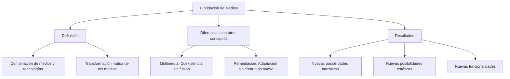

## Introducción: ¿Qué es la hibridación de medios? 

La <strong>hibridación de medios</strong>, según  Manovich, es la combinación de diferentes formas de medios y tecnologías en un único objeto o experiencia cultural. En este proceso  los medios se transforman mutuamente, generando nuevas posibilidades estéticas, narrativas o funcionales. 

A diferencia de conceptos como:
- **Multimedia:** Distintos formatos conviven sin fusionarse completamente.
- **Remediación:** Un medio preexistente se adapta a otro. 

La hibridación implica la creación de algo completamente nuevo a partir de esa interacción.

Vamos a proceder a analizar dos casos de hibridación relacionados principalmente con la realidad virtual y la cultura.
# Caso 1: Wander

<strong>Wander</strong> es una herramienta que utiliza la realidad virtual para permitir a los usuarios explorar lugares reales desde cualquier ubicación. Esta experiencia inmersiva combina elementos como fotografías geolocalizadas de Google Street View, interactividad y entornos virtuales, transformando por completo la forma en que las personas pueden "viajar" sin moverse físicamente. Al utilizar Wander, los usuarios no solo observan un lugar, sino que lo experimentan de una forma más real y envolvente, generando una conexión emocional y sensorial con el espacio que antes era difícil de lograr con otros medios.

Antes de herramientas como Wander, explorar lugares remotos desde casa era una experiencia limitada y poco inmersiva. Las imágenes estáticas o las guías de viaje ofrecían solo una visión parcial y fragmentada de los lugares, con escaso contexto interactivo, lo que hacía que la experiencia fuera meramente informativa. Los documentales o videos turísticos proporcionaban más detalles y atractivos visuales, pero mantenían al espectador en un rol pasivo, sin control sobre qué aspectos explorar. Por su parte, los mapas digitales o las enciclopedias carecían de la capacidad de generar una sensación de presencia en el lugar, dejando la experiencia como algo únicamente intelectual y no vivencial.

La introducción de <strong>Wander</strong> representa un cambio radical al superar estas limitaciones. Esta herramienta transforma la experiencia tradicional de exploración mediante la integración de diversos elementos tecnológicos que redefinen cómo interactuamos con los espacios virtuales. Por un lado, la interactividad y la navegación permiten que los usuarios se desplacen libremente dentro del entorno virtual, otorgándoles la libertad de elegir qué aspectos explorar según sus intereses. Esta capacidad de tomar decisiones en tiempo real convierte al usuario en un participante activo, en lugar de un observador pasivo. 

Además, la incorporación de fotografías en 360° ofrece una representación visual inmersiva que simula la perspectiva de estar físicamente en el lugar. Esto crea una sensación de presencia mucho más realista, envolviendo al usuario en un entorno que se siente real.

Más allá del turismo virtual, <strong>Wander</strong> tiene aplicaciones en diversos campos, como la educación, la cultura y la salud. En el ámbito académico, por ejemplo, permite a estudiantes "visitar" monumentos históricos, museos y sitios arqueológicos de manera sencilla con un par de clicks. Esta herramienta también puede enriquecer las clases de geografía, historia o arte al ofrecer experiencias visuales inmersivas que complementan la enseñanza tradicional. 

En terapias, <strong>Wander</strong> puede ser una herramienta poderosa para personas con movilidad reducida, permitiéndoles experimentar lugares que, de otra manera, estarían fuera de su alcance. Esta capacidad de acceso remoto puede tener un impacto emocional positivo, mejorando la calidad de vida de los usuarios y ayudándolos a conectarse con el mundo exterior.

Además de estas aplicaciones prácticas, <strong>Wander</strong> también invita a reflexionar sobre cómo nos relacionamos con los espacios y los lugares. En un contexto donde la movilidad global a menudo está restringida por factores económicos, ambientales o de salud, herramientas como Wander abren nuevas posibilidades para explorar y aprender sobre el mundo sin necesidad de viajar físicamente. 

En resumen, <strong>Wander</strong> no solo representa una innovación tecnológica, sino también una redefinición de cómo experimentamos y nos relacionamos con el espacio y el lugar. Al combinar elementos de realidad virtual, interactividad, fotografía y datos geográficos, esta herramienta supera las limitaciones de los medios tradicionales, ofreciendo una experiencia transformadora y significativa. Su capacidad para conectar a las personas con el mundo, independientemente de las barreras físicas o económicas.

# Caso 2: Tilt Bush

<strong>Google Tilt Brush</strong> es una herramienta que permite a los usuarios crear obras de arte en un espacio tridimensional mediante el uso de realidad virtual. Utilizando un cascos de realida virtual y un par de mandos, los usuarios pueden "pintar" en un entorno 3D, creando diseños, paisajes y esculturas que parecen flotar a su alrededor. Esta experiencia transforma por completo la forma en que se concibe el arte, permitiendo una libertad creativa nunca antes vista en los medios tradicionales.

Antes de herramientas como <strong>Tilt Brush</strong>, las posibilidades de crear arte en tres dimensiones estaban limitadas a técnicas como la escultura física o el modelado digital en dos dimensiones. Las obras creadas con arcilla, metal o madera requieren de un espacio físico concreto y de herramientas especializadas, mientras que los programas de diseño 3D, no pueden ofrecer una sensación tan envolvente ni tan intuitiva como la que proporciona la realidad virtual.

<strong>Tilt Brush</strong> revoluciona esta experiencia artística mediante la integración de varios elementos tecnológicos que permiten a los usuarios crear de manera interactiva y envolvente. En primer lugar, la interactividad y la inmersión son fundamentales en Tilt Brush, ya que el usuario puede literalmente moverse a través de su creación, pintando y esculpiendo mientras está rodeado de su obra. Esta capacidad de interactuar físicamente con el arte le da al usuario un control total sobre su proceso creativo, a diferencia de los medios tradicionales donde la creación es más estática.

Además, <strong>Tilt Brush</strong> utiliza una amplia variedad de pinceles y herramientas, permitiendo que el artista elija entre efectos visuales, texturas y colores que se adaptan a sus necesidades. Desde pinceles que crean trazos simples hasta efectos más complejos como luces de neón o elementos que simulan el fuego, cada herramienta amplía las posibilidades creativas y ofrece una gama de formas de expresión artística. Esta flexibilidad es otro de los factores que distingue a Tilt Brush de los medios tradicionales, donde los materiales son limitados y el resultado final puede estar restringido por las capacidades del medio elegido.

Por último, la integración de la realidad virtual en Tilt Brush permite una experiencia de creación completamente inmersiva. A través del visor de realida virtual, los usuarios pueden sentir que están pintando en un espacio tridimensional, rodeados de sus propias creaciones. Esta sensación de presencia transforma la creación de arte en un proceso más vivencial, permitiendo que el usuario se mueva libremente y vea su obra desde diferentes ángulos y perspectivas.

<strong>Google Tilt Brush</strong> no solo facilita la creación artística en un entorno digital, sino que también abre nuevas posibilidades en campos como el diseño, la educación y la arquitectura. En el ámbito académico, por ejemplo, puede utilizarse como herramienta para enseñar conceptos de geometría, perspectiva y arte, permitiendo a los estudiantes experimentar con modelos tridimensionales y aprender a crear en un espacio virtual. En el diseño de productos, Tilt Brush permite a los diseñadores crear prototipos y visualizaciones de manera rápida y eficiente, sin necesidad de herramientas físicas o de software complejo. Y en la arquitectura, permite a los profesionales crear modelos 3D de edificios y estructuras, visualizando su diseño desde todos los ángulos antes de realizar la construcción física.

Más allá de sus aplicaciones prácticas, <strong>Tilt Brush</strong> invita a una reflexión sobre la evolución de las herramientas artísticas y su impacto en la creatividad humana. Mientras que los artistas han estado creando durante siglos con medios físicos, la realidad virtual permite una expansión de estas fronteras, proporcionando nuevas formas de expresión que antes solo existían en la imaginación.

En conclusión, <strong>Google Tilt Brush</strong> no es solo una herramienta para crear arte, sino una redefinición de lo que significa ser un artista en la era digital. Al integrar elementos de realidad virtual, interactividad y una amplia gama de herramientas visuales, Tilt Brush ofrece una experiencia única en el mundo del arte digital.

# Conclusion

Tanto <strong>Wander</strong> como <strong>Google Tilt Brush</strong> son ejemplos de hibridación de medios, transformando las experiencias de exploración y creación. Wander ofrece una experiencia de viaje virtual inmersiva, utilizando fotografía en 360°, interactividad y datos geográficos para permitir que los usuarios exploren lugares remotos como si estuvieran allí, algo que los medios tradicionales no pueden lograr. Su capacidad para mezclar lo visual con lo geográfico redefine la manera en que nos relacionamos con el mundo.

Por su parte, Google Tilt Brush revoluciona el arte digital al permitir la creación tridimensional en un espacio virtual. Usando realidad virtual y herramientas interactivas, Tilt Brush otorga una libertad creativa sin igual, transformando el proceso artístico al hacer que los usuarios puedan mover y trabajar en sus obras desde cualquier ángulo. Su impacto va más allá del arte, con aplicaciones en diseño, arquitectura y educación.

Ambos casos son ejemplos claros de cómo la hibridación de medios puede ofrecer experiencias inmersivas y participativas, transformando la interacción con el arte y el espacio. Wander y Tilt Brush no solo mejoran lo existente, sino que abren nuevas formas de experiencia y creatividad, permitiendo una conexión más profunda y activa con el mundo y el arte.

# Referencias

1. **Manovich, L.** (2013). *El software toma el mando.*
2. **Muñoz-Justicia, J.** (2014). *Conocimiento Abierto y Tecnología.*
3. **McMillan, R** (2012). *Lord of the Files: How GitHub Tamed Free Software (And More).*
4. **Pixartprinting S.p.A.** (2017). *Pintar en 3D mediante realidad virtual.* 
https://www.pixartprinting.es/blog/google-tilt-brush/
5. **VRVoyaging** (2022). *Wander. A great way to tour the earth.* 
https://www.vrvoyaging.com/wander/

