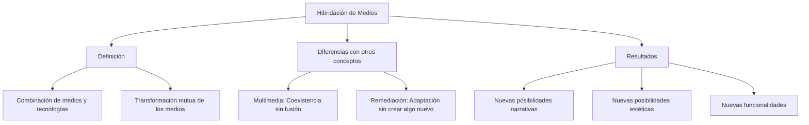

## Introducción: ¿Qué es la hibridación de medios? 
La **hibridación de medios**, según Lev Manovich, se refiere a la combinación de diferentes formas de medios y tecnologías en un único objeto o experiencia cultural. Este proceso trasciende la simple coexistencia de elementos y da lugar a una integración profunda, donde los medios se transforman mutuamente, generando nuevas posibilidades estéticas, narrativas o funcionales. 

A diferencia de conceptos como:
- **Multimedia:** Distintos formatos conviven sin fusionarse completamente.
- **Remediación:** Un medio preexistente se adapta a otro. 

La hibridación implica la creación de algo completamente nuevo a partir de esa interacción.

